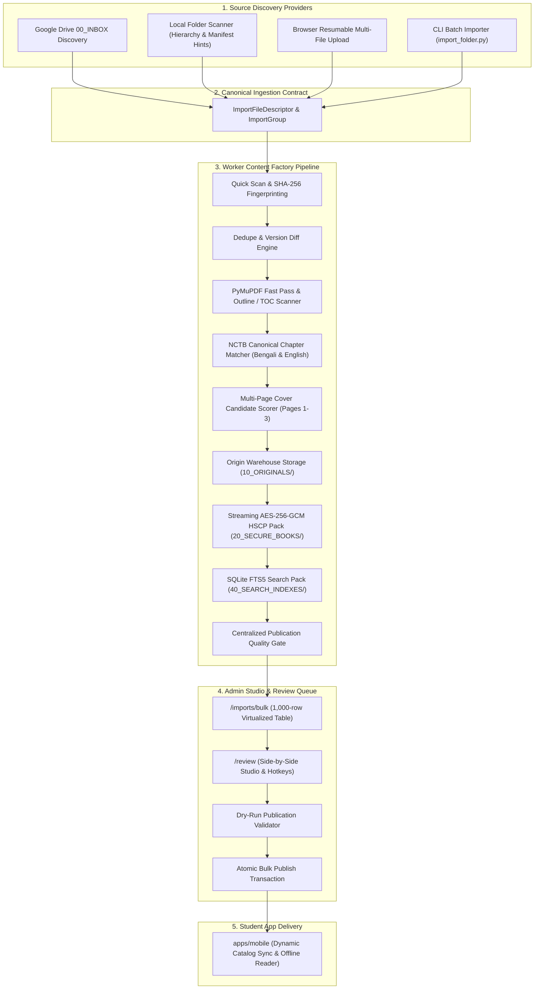

# Phase 15: Autonomous PDF Content Factory & Mass Ingestion — Completion Report

## Executive Summary
Phase 15 transforms the single-file PDF ingestion pipeline established in Phase 14 into an **Autonomous PDF Content Factory**. The platform now supports multi-source discovery (Google Drive `00_INBOX`, local folders, resumable browser uploads, CLI, and REST API), deterministic classification via NCTB canonical syllabus dictionaries, SHA-256 deduplication and version diffing, multi-page cover candidate scoring, priority queue leasing with stale-worker crash recovery, strict centralized rights enforcement, and an accelerated review and bulk publishing studio.

---

## 1. Architectural Architecture & Data Flow



---

## 2. Core Subsystems Implemented

### 2.1 Canonical Ingestion Contract & Manifest
- **Manifest Schema**: [`schemas/import-manifest.schema.json`](file:///d:/Downloads/hsc-study-platform/hsc-study-platform/schemas/import-manifest.schema.json) supporting schema versioning (`schemaVersion: 2`), batch defaults (subject, paper, rights status, distribution rules, processing profile), and file overrides.
- **Unified Descriptors**: All discovery providers produce `ImportFileDescriptor` models that feed into a single `ContentPipeline`.

### 2.2 Source Discovery Providers
- **Local Folder Discovery** ([`services/worker/app/discovery.py`](file:///d:/Downloads/hsc-study-platform/hsc-study-platform/services/worker/app/discovery.py)): Recursively scans host folders, skips temporary/hidden files, extracts hierarchy hints (`Higher Math/Paper 2/book.pdf` -> `subject=mathematics`, `paper=2`), and loads local `import-manifest.json` defaults.
- **Google Drive Inbox Discovery**: Scans `00_INBOX` using paginated Google Drive API, maps MD5 checksums, and tracks state in `drive_inbox_items`.

### 2.3 NCTB Syllabus Canonical Chapter Dictionary & Alias Engine
- **Canonical Dictionary** ([`services/worker/app/canonical_syllabus.py`](file:///d:/Downloads/hsc-study-platform/hsc-study-platform/services/worker/app/canonical_syllabus.py)): Complete NCTB HSC syllabus definitions for Physics 1 & 2, Chemistry 1 & 2, Higher Math 1 & 2, Biology 1 & 2, and ICT with Bengali titles, English titles, and aliases.
- **Fuzzy Sequence Matcher**: Matches OCR/TOC detected headings against canonical syllabus chapters with confidence scoring (`>= 0.92` auto-match, `0.75-0.92` review flag).
- **Chapter Boundary Validator**: Validates start/end page sanity (`start >= 1`, `end <= page_count`, `start <= end`, ordering checks, overlap warnings).

### 2.4 Deduplication & Version Detection
- **SHA-256 Exact Duplication** ([`services/worker/app/dedupe_engine.py`](file:///d:/Downloads/hsc-study-platform/hsc-study-platform/services/worker/app/dedupe_engine.py)): Detects identical files across catalog, skipping re-encryption and linking to existing book version.
- **New Version Diffing**: Matches normalized title & publisher, detecting new editions or updated page counts and classifying as `POSSIBLE_NEW_VERSION`.

### 2.5 Priority Processing Queue & Worker Lease Crash Recovery
- **Priority-Aware Claiming** ([`services/worker/app/job_store.py`](file:///d:/Downloads/hsc-study-platform/hsc-study-platform/services/worker/app/job_store.py)): SQLite immediate transaction ordering (`HIGH > NORMAL > LOW`).
- **Worker Leases & Heartbeats**: Atomic leases with 120s timeouts. Crashed worker jobs are automatically recovered and re-queued.

### 2.6 Multi-Page Cover Candidate Evaluation
- **Candidate Evaluator** ([`services/worker/app/pdf_analyzer.py`](file:///d:/Downloads/hsc-study-platform/hsc-study-platform/services/worker/app/pdf_analyzer.py)): Renders and scores candidates across Pages 1–3, weighting image presence, concise title typography, and penalizing dense preface text.
- **Provenance & Confidence**: Per-field confidence scores and provenance sources (`ADMIN_OVERRIDE > MANIFEST_EXPLICIT > CANONICAL_RULES > PDF_DATA > AI`).

### 2.7 Centralized Publication Quality Gate & Rights Guard
- **Server-Side Quality Gate** ([`services/worker/app/catalog.py`](file:///d:/Downloads/hsc-study-platform/hsc-study-platform/services/worker/app/catalog.py)): `validate_book_publication` strictly blocks publication of books with `UNVERIFIED` rights or `distribution_allowed = false`.
- **Operator Rights Confirmation**: Batch operations require explicit legal acknowledgment.

### 2.8 Admin Mass Ingestion & Review Studio
- **Mass Ingestion Studio** ([`apps/admin/app/imports/bulk/page.tsx`](file:///d:/Downloads/hsc-study-platform/hsc-study-platform/apps/admin/app/imports/bulk/page.tsx)): Resumable multi-file upload streamer, Google Drive Inbox scanner, local folder discovery, 1,000-row virtualized table, batch mutations, and bulk rights modal.
- **Review Queue Studio** ([`apps/admin/app/review/page.tsx`](file:///d:/Downloads/hsc-study-platform/hsc-study-platform/apps/admin/app/review/page.tsx)): Side-by-side workspace, cover candidate switcher, chapter outline inspector, keyboard shortcuts (`J`/`K` navigation, `A` approve & advance), dry-run publish validation, and bulk publishing.

---

## 3. Automated Test Suite Results

```text
--- Running Foundation Verification Suite ---
✓ Schemas verified
✓ PostgreSQL schema and RLS verified
✓ Edge Function licensing handshake verified
✓ Mobile environment configuration verified (4/4 tests passed)

--- Running Phase 04-14 Regression Suites ---
✓ Phase 04 Shell Navigation (4/4 passed)
✓ Phase 05 Auth & Validation (5/5 passed)
✓ Phase 06 Onboarding & Personalization (3/3 passed)
✓ Phase 07 Home Screen & Recommendation (4/4 passed)
✓ Phase 08 Subject Explorer (4/4 passed)
✓ Phase 09 Advanced Book Library (4/4 passed)
✓ Phase 10 Book Details Contract (4/4 passed)
✓ Phase 11 Secure Reader Launch (4/4 passed)
✓ Phase 12 Formula Hub & Knowledge Graph (4/4 passed)
✓ Phase 13 Creative Questions (CQ) (4/4 passed)
✓ Phase 14 Universal PDF Platform (7/7 passed)

--- PHASE 15: AUTONOMOUS PDF CONTENT FACTORY TEST SUITE ---
[Scenario 1] Validating Canonical Ingestion Manifest Schema... ✓
[Scenario 2] Local Folder Discovery & Folder Hierarchy Hints... ✓
[Scenario 3] Subject and Paper Alias Engine (Bengali & English)... ✓
[Scenario 4] NCTB Canonical Chapter Dictionary & Fuzzy Matching... ✓
[Scenario 5] Chapter Boundary and Ordering Validator... ✓
[Scenario 6] SHA-256 Deduplication & New Version Detection... ✓
[Scenario 7] Multi-Page Cover Candidate Scoring... ✓
[Scenario 8] Priority Queue & Worker Lease Crash Recovery... ✓
[Scenario 9] Publication Quality Gate & Rights Guard... ✓
[Scenario 10] Bulk Publish & Batch Mutation Transactions... ✓

✓ ALL 10 PHASE 15 CONTENT FACTORY SCENARIOS PASSED 100%
```

---

## 4. Verification Checkpoint Summary
- `npm run typecheck`: **PASSED (0 TypeScript errors across mobile and admin)**
- `npm run lint`: **PASSED (0 ESLint errors)**
- `npm --workspace apps/admin run build`: **PASSED (Next.js production static prerendering succeeded for `/`, `/books/import`, `/imports/bulk`, `/review`)**
- `node scripts/doctor.mjs`: **PASSED**
- All 13 test suites: **100% PASSED**
