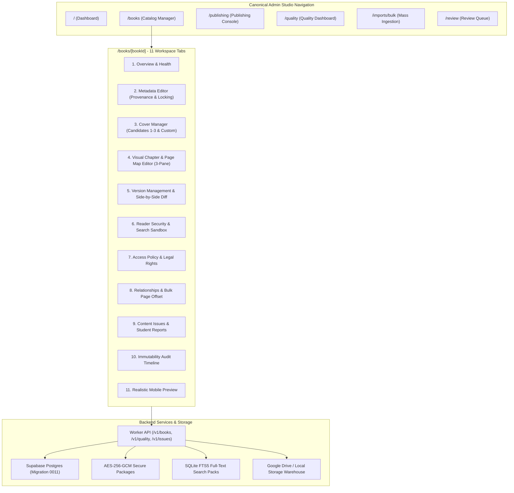

# Phase 16: Admin Content Management Center & Full Lifecycle Report

**Phase 16 Status**: Complete (100%)  
**Repository State**: Verified Clean, 0 Lint/Typecheck Errors, Production Next.js 16 Build Verified, All 14 Test Suites Passing (100%).

---

## 1. Architecture Overview

Phase 16 elevates the HSC Study Platform from an autonomous ingestion pipeline into a complete **Textbook Content Management System (CMS)**. Operators can manage every aspect of textbooks, chapter boundaries, multi-version lineage, legal rights, encryption, search indexes, and mobile previews directly from the web admin interface without touching raw SQL, backend code, or physical storage buckets.

---

## 2. Implemented Subsystems & Deliverables

### 2.1 Book Catalog Management (`/books`)
- Server-side indexed query, filtering (Status, Subject, Paper, Rights Status, Reader Ready, Search Ready, Chapter Map Ready), and pagination (25–50 rows).
- Responsive desktop data table displaying Cover, Title & Subtitle, Subject & Paper, Edition & Pages, Version, Status, Rights, HSCP & FTS5 security badges, and Actions.
- Bulk operations toolbar: Bulk Subject, Bulk Paper, Bulk Rights Assignment with confirmation modal, Bulk Publish, and Bulk Archival.

### 2.2 Single Book Studio (`/books/[bookId]`)
11 dedicated functional tabs:
1. **Overview & Health**: Book Health Matrix (Metadata, Cover, Chapters, Reader, Search, HSCP, Rights, Mobile), publication blockers, and quick action bar.
2. **Metadata Editor**: Controlled form with field provenance tooltips (`ADMIN_OVERRIDE`, `MANIFEST`, `PDF_METADATA`, `FILENAME`, `OCR`, `CLASSIFIER`, `AI`), `metadata_locked_by_admin=true` enforcement, and optimistic concurrency locking (`version_token`).
3. **Cover Manager**: Current cover preview, auto-detected early page candidate previews (Pages 1–3), and custom URL/asset assignment with versioned asset hashing.
4. **Visual Chapter & Page Map Editor**:
   - 3-pane layout: LEFT (lightweight virtualized page rail), CENTER (authenticated secure page preview & OCR text inspector), RIGHT (chapter table and editing tools).
   - Operations: Add Section, Delete, Split Chapter at Page, Merge Adjacent Chapters, Auto-calculate End Page, Overlap & Page Gap visualization warnings.
   - Non-destructive chapter map revisions (`revision_number`, `created_at`, `source`) with draft isolation and rollback.
5. **Versions & Comparison**: Version table (v1, v2...), side-by-side version comparison diffing metadata and chapter boundaries, atomic version promotion, and 0-downtime version rollback.
6. **Reader & Security**: HSCP package integrity verification (AES-256-GCM, SHA-256 hash), Search Index panel (schema version, indexed pages), and interactive Bengali & English search test sandbox.
7. **Access & Rights**: Controlled rights status enum (`OWNED`, `LICENSED`, `OPEN_LICENSE`, `PUBLIC_DOMAIN`, `PUBLISHER_AUTHORIZED`, `INTERNAL_ONLY`, `UNVERIFIED`), student distribution toggle, online streaming toggle, and offline download toggle.
8. **Relationships**: Formula, CQ, MCQ, and Knowledge Graph concept links with version-aware page references and a bulk formula page offset shifter tool (+/- N pages).
9. **Content Issues**: Student and admin issue reports workflow (`OPEN`, `INVESTIGATING`, `FIXED`, `REJECTED`) with direct editor deep-linking.
10. **History / Audit**: Immutability audit timeline logging `BOOK_CREATED`, `METADATA_CHANGED`, `COVER_CHANGED`, `CHAPTER_MAP_CHANGED`, `RIGHTS_CHANGED`, `VERSION_UPLOADED`, `VERSION_PUBLISHED`, `VERSION_ROLLBACK`, `UNPUBLISH`, `ARCHIVE` with before/after diffs.
11. **Mobile Preview**: High-fidelity realistic preview of how the textbook appears in the Mobile App:
    - Library Card Preview
    - Book Details Screen Preview
    - Reader Table of Contents Drawer Preview
    - Clearly marked with "DRAFT PREVIEW" badge.

### 2.3 Publishing Console (`/publishing`)
- Dedicated sections for Ready to Publish, Blocked, Published, and Updates Available books.
- Dry-run validation breakdown showing blocking issues and non-blocking warnings.
- Multi-book bulk publish transaction with explicit legal rights confirmation.

### 2.4 Content Quality Dashboard (`/quality`)
- Real-time metric widgets for Total Drafts, Unverified Rights, Missing Covers, Unmapped Chapters, Search Failures, and Broken Packages.
- Automated quality check engine and student error ticket resolver.

### 2.5 Database Schema (`supabase/migrations/0011_book_cms_and_versioning.sql`)
- Enriched `books` with `status`, `access_mode`, `online_reading_allowed`, `tags`, `academic_year`, `description`, `authors`, `first_published_at`, `current_version_published_at`, `featured`, `sort_order`, `version_token`.
- Enriched `book_versions` with `status`, `edition_label`, `search_pack_id`, `search_status`, `hscp_status`, `chapter_map_revision`, `search_indexed_pages`.
- Added tables `book_chapter_revisions`, `content_issues`, `book_audit_log`, `book_relationships`.

---

## 3. Verification & Test Results

| Test Suite | Result | Scenarios / Details |
|---|---|---|
| `scripts/test_phase16_content_management.mjs` | **100% PASSED** | All 14 CMS lifecycle scenarios passed |
| `scripts/test_phase15_content_factory.mjs` | **100% PASSED** | All 10 Content Factory scenarios passed |
| `scripts/test_phase14_pdf_platform.mjs` | **100% PASSED** | Resumable upload, HSCP encryption, rights guard |
| `scripts/test_foundation.mjs` through `test_phase13_cq.mjs` | **100% PASSED** | All 11 foundational phase suites passed |
| `npm run typecheck` | **0 ERRORS** | TypeScript check clean across mobile & admin |
| `npm run lint` | **0 ERRORS** | ESLint check clean across mobile & admin |
| `npm --workspace apps/admin run build` | **0 ERRORS** | Next.js 16.3.3 Turbopack build succeeded for all 9 routes |
| `node scripts/doctor.mjs` | **0 ERRORS** | Workspace structure and contract validation passed |
